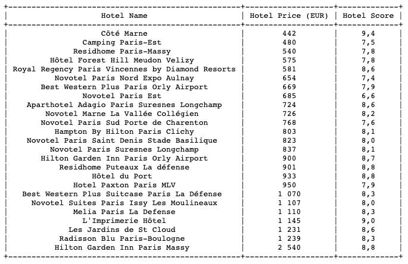

# Pet Project: Bot www.booking.com

This bot performs actions of:   
- changing currency input destination, 
- chooses check-in and check-out dates, 
- specifies number of 
travellers, 
- filters data on 4 and 5-star hotels, 
- sorts results by best rating score,
- and saves results in `.txt` file in ascending by price order.

## Getting Started

1. Download or clone repository   `https://github.com/peperd/booking.com-bot.git`
2. Install venv   `$ pip install virtualenv`
3. Install selenium   `$ pip install -U selenium`
4. Run run.py   `$ python3 run.py`
5. run.py will open browser and open `https://www.booking.com/`
6. In terminal you find first question: `Where you want to go? (input destination city)`
    > ex. Paris
7. In terminal you find second question: `What is check-in date? (input in YYYY-MM-DD format)`
    > date should be within 40 days from now
8. In terminal you find third question: `What is check-out date? (input in YYYY-MM-DD format)`
    > date should be within 40 days from now
9. In terminal you find forth question: `How many people? (input number)`
    > number from 1 to 20
10. As result will be generated file table.txt where will be placed all results
   that satisfied your requirements specified above for 4 and 5 stars hotels in ascending order.

### Prerequisites
1. You need `python 3.7+` to be installed
2. Website `www.booking.com` must be opened with localization to Ukraine (language - Ukrainian, currency - UAH)
3. Required environment variables: `export CHROME_DRIVER_PATH="<path to chrome driver>"`

## Built With

